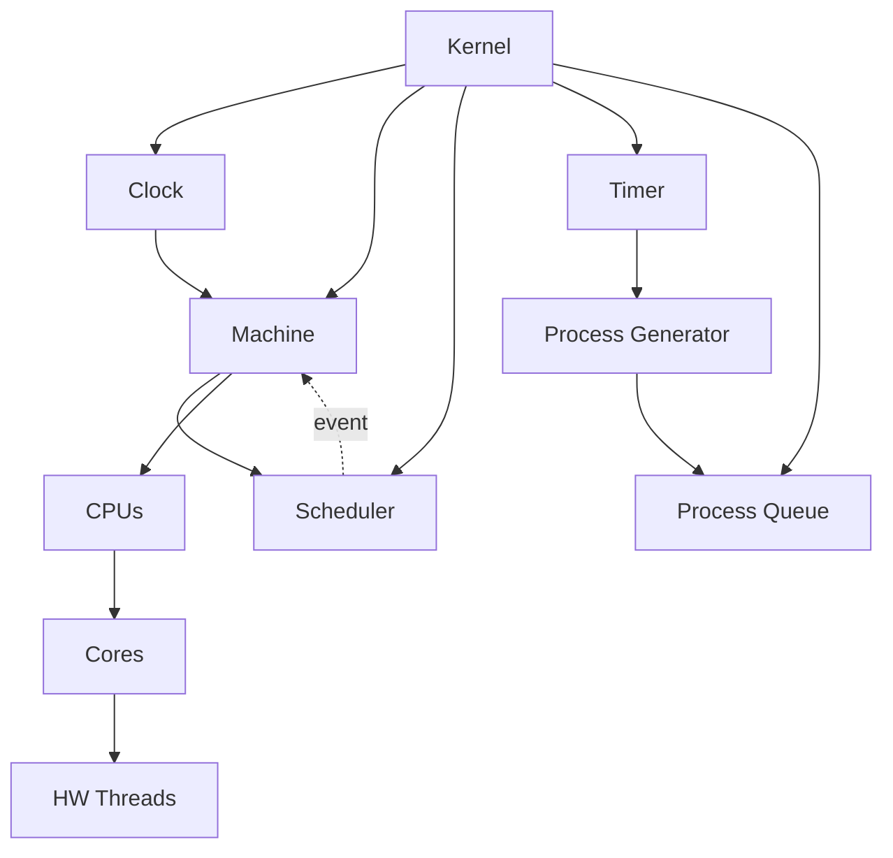
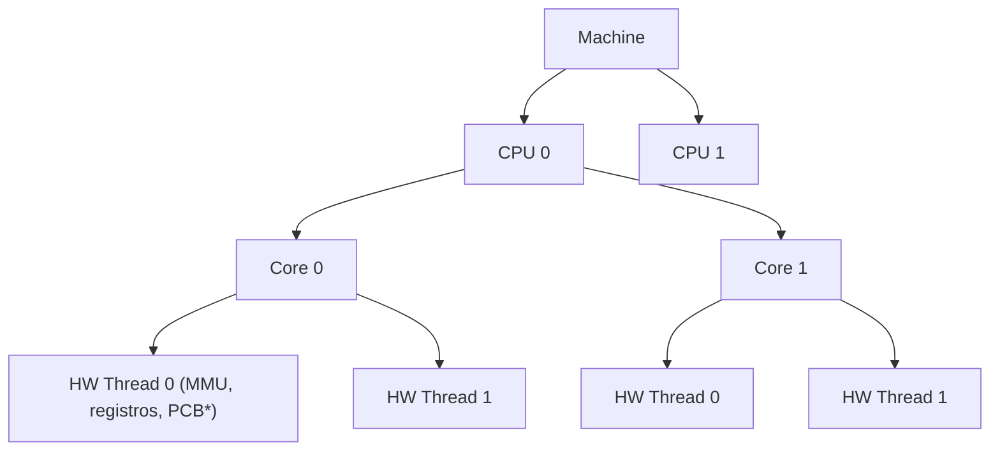

# Parte 1: Arquitectura Base del Kernel

## Introducción

La primera parte del proyecto establece los fundamentos del simulador: el motor de tiempo (Clock), el sistema de generación de procesos (Timer y Process Generator), y los mecanismos de sincronización multihilo que permiten la coordinación entre todos los componentes.

## Arquitectura General

El sistema implementa una arquitectura modular donde cada componente tiene responsabilidades claramente definidas. El Kernel actúa como orquestador principal, coordinando el Clock que genera ticks periódicos, la Machine que simula la arquitectura hardware, y el Scheduler event-driven que responde a eventos específicos.



Los eventos principales del sistema incluyen quantum expirado, proceso terminado y creación de nuevo proceso, todos gestionados de forma asíncrona mediante señalización.

## Clock: Motor del Sistema

El Clock actúa como corazón del simulador, generando pulsos periódicos (ticks) que impulsan todo el sistema. Su implementación utiliza un bucle activo que espera el tiempo configurado, incrementa el contador global de ticks, llama a `machine_advance_cycle()`, detecta eventos para scheduling y notifica al Timer. Esta aproximación se eligió por su simplicidad de debugging, precisión en el control de velocidad, portabilidad entre sistemas operativos y comportamiento determinístico. El uso de `usleep()` permite configurar la velocidad de simulación mediante el flag `-s` sin necesidad de recompilar.

## Timer: Generador de Interrupciones

### Diseño

El Timer implementa un temporizador que genera interrupciones periódicas para el Process Generator. Su funcionamiento es análogo a un timer hardware que cuenta ciclos y genera interrupciones cuando se alcanza el periodo configurado.

### Implementación

```c
void timer_tick(Timer* timer)
{
    pthread_mutex_lock(&timer->mutex);
    timer->ticks_since_last_interrupt++;
    
    if (timer->ticks_since_last_interrupt >= timer->period) {
        timer->ticks_since_last_interrupt = 0;
        pthread_cond_signal(&timer->interrupt_cond);
    }
    
    pthread_mutex_unlock(&timer->mutex);
}
```

El Process Generator espera estas interrupciones:

```c
void* process_generator_thread_func(void* arg)
{
    Kernel* kernel = (Kernel*)arg;
    Timer* timer = kernel->timer;
    
    while (1) {
        pthread_mutex_lock(&timer->mutex);
        while (!timer->shutdown_requested && 
               timer->ticks_since_last_interrupt < timer->period) {
            pthread_cond_wait(&timer->interrupt_cond, &timer->mutex);
        }
        
        if (timer->shutdown_requested) {
            pthread_mutex_unlock(&timer->mutex);
            break;
        }
        pthread_mutex_unlock(&timer->mutex);
        
        // Generar nuevo proceso
        PCB* pcb = pcb_create_random(kernel->next_pid++);
        process_queue_enqueue(kernel->process_queue, pcb);
        kernel_signal_scheduler(kernel);
    }
    
    return NULL;
}
```

### Decisiones de Diseño

**¿Por qué separar Timer de Clock?**

- **Separación de responsabilidades**: Clock maneja tiempo global, Timer maneja interrupciones específicas
- **Realismo**: Refleja la arquitectura de SO reales donde timers y relojes son componentes separados
- **Flexibilidad**: El periodo del timer es independiente de la velocidad del clock

**¿Por qué usar `pthread_cond_wait()`?**

- **Eficiencia**: No consume CPU mientras espera
- **Sincronización correcta**: Evita race conditions
- **Patrón estándar**: Refleja cómo funcionan las interrupciones en SO reales (espera bloqueante)

## Process Control Block (PCB)

### Diseño

El PCB es la estructura de datos que representa un proceso en el sistema. Contiene toda la información necesaria para gestionar el proceso:

```c
typedef struct {
    uint32_t pid;                    // Process ID
    uint32_t ttl;                    // Time to live (ticks restantes)
    ProcessState state;              // Estado del proceso
    uint32_t cpu_id;                 // CPU donde está ejecutando
    uint32_t core_id;                // Core donde está ejecutando
    uint32_t hw_thread_id;           // HW thread donde está ejecutando
    uint32_t ticks_since_swap;       // Ticks desde último context switch
    uint32_t temperature;            // Para Chocolate Caliente
    
    // Gestión de memoria (Parte 3)
    int is_loaded;                   // Si tiene programa cargado
    MemoryLayout mm;                 // Layout de memoria
    char program_path[256];          // Ruta al archivo .elf
} PCB;
```

### Estados del Proceso

```c
typedef enum {
    PROCESS_STATE_READY,       // Listo para ejecutar
    PROCESS_STATE_RUNNING,     // Ejecutando
    PROCESS_STATE_TERMINATED   // Terminado
} ProcessState;
```

El sistema no implementa estados BLOCKED porque no hay I/O simulada (simplificación justificable para un simulador educativo).

### Generación de Procesos

Los procesos se generan aleatoriamente con:

```c
PCB* pcb_create_random(uint32_t pid)
{
    PCB* pcb = malloc(sizeof(PCB));
    pcb->pid = pid;
    pcb->ttl = (rand() % 91) + 10;  // TTL entre 10-100 ticks
    pcb->state = PROCESS_STATE_READY;
    pcb->temperature = 0;
    pcb->ticks_since_swap = 0;
    pcb->is_loaded = 0;
    return pcb;
}
```

## Process Queue

### Diseño

La cola de procesos es una estructura FIFO thread-safe que almacena todos los procesos en estado READY. Implementa las operaciones básicas:

- `enqueue()`: Añadir proceso al final
- `dequeue()`: Extraer proceso del principio
- `is_empty()`: Verificar si está vacía

### Implementación Thread-Safe

```c
typedef struct {
    PCB** processes;
    uint32_t head;
    uint32_t tail;
    uint32_t size;
    uint32_t capacity;
    pthread_mutex_t mutex;
} ProcessQueue;
```

Toda operación está protegida por mutex:

```c
void process_queue_enqueue(ProcessQueue* queue, PCB* pcb)
{
    pthread_mutex_lock(&queue->mutex);
    
    // Redimensionar si es necesario
    if (queue->size >= queue->capacity) {
        queue->capacity *= 2;
        queue->processes = realloc(queue->processes, 
                                  queue->capacity * sizeof(PCB*));
    }
    
    queue->processes[queue->tail] = pcb;
    queue->tail = (queue->tail + 1) % queue->capacity;
    queue->size++;
    
    pthread_mutex_unlock(&queue->mutex);
}
```

### Decisiones de Diseño

**¿Por qué un array circular en lugar de lista enlazada?**

- **Eficiencia**: Mejor localidad de cache
- **Simplicidad**: Menos punteros, menos posibilidad de bugs
- **Redimensionamiento dinámico**: Soporta crecimiento sin fragmentación

## Machine: Simulación Hardware

### Diseño

La Machine representa la arquitectura física del sistema con una jerarquía de tres niveles:



### Estructura de Datos

```c
typedef struct {
    MMU* mmu;              // Memory Management Unit (Parte 3)
    PCB* current_pcb;      // Proceso actualmente ejecutando
} HWThread;

typedef struct {
    HWThread* threads;
    uint32_t num_threads;
} Core;

typedef struct {
    Core* cores;
    uint32_t num_cores;
} CPU;

typedef struct {
    CPU* cpus;
    uint32_t num_cpus;
    uint32_t num_cores_per_cpu;
    uint32_t num_hw_threads_per_core;
    uint32_t total_hw_threads;
    pthread_mutex_t mutex;
} Machine;
```

### Ciclo de Ejecución

El método más crítico de Machine es `machine_advance_cycle()`, que se ejecuta en cada tick del Clock:

```c
void machine_advance_cycle(Machine* machine, Kernel* kernel)
{
    pthread_mutex_lock(&machine->mutex);
    
    for (uint32_t cpu = 0; cpu < machine->num_cpus; cpu++) {
        for (uint32_t core = 0; core < machine->num_cores_per_cpu; core++) {
            for (uint32_t t = 0; t < machine->num_hw_threads_per_core; t++) {
                HWThread* thread = &machine->cpus[cpu].cores[core].threads[t];
                
                if (!thread->current_pcb) continue;
                PCB* pcb = thread->current_pcb;
                
                // Ejecutar instrucción si hay programa cargado
                if (pcb->is_loaded && thread->mmu) {
                    instruction_execute(thread->mmu, &machine->physical_memory);
                }
                
                // Decrementar TTL
                if (pcb->ttl > 0) {
                    pcb->ttl--;
                }
                
                // Incrementar contadores
                pcb->ticks_since_swap++;
                
                // Actualizar temperatura (Chocolate Caliente)
                if (kernel->config.scheduler_algorithm == 
                    SCHEDULER_CHOCOLATE_CALIENTE) {
                    pcb->temperature = (pcb->temperature < 100) ? 
                                      pcb->temperature + 8 : 100;
                }
                
                // Detectar eventos
                int needs_scheduling = 0;
                
                // Evento: Proceso terminó
                if (pcb->ttl == 0 || pcb->state == PROCESS_STATE_TERMINATED) {
                    needs_scheduling = 1;
                }
                
                // Evento: Quantum expirado (RR y CH)
                if (kernel->config.scheduler_algorithm == SCHEDULER_ROUND_ROBIN) {
                    if (pcb->ticks_since_swap >= kernel->config.rr_quantum) {
                        needs_scheduling = 1;
                    }
                } else if (kernel->config.scheduler_algorithm == 
                          SCHEDULER_CHOCOLATE_CALIENTE) {
                    uint32_t max_quantum = get_max_quantum_by_temperature(
                        pcb->temperature, kernel->config.rr_quantum);
                    if (pcb->ticks_since_swap >= max_quantum) {
                        needs_scheduling = 1;
                    }
                }
                
                if (needs_scheduling) {
                    scheduler_update_thread(kernel, thread, cpu, core, t);
                }
            }
        }
    }
    
    pthread_mutex_unlock(&machine->mutex);
}
```

### Decisiones de Diseño

**¿Por qué detectar eventos en `machine_advance_cycle()`?**

- **Eficiencia**: Evita polling separado del scheduler
- **Atomicidad**: La detección y el avance de estado ocurren juntos
- **Realismo**: Similar a cómo un procesador real detecta interrupciones durante la ejecución

**¿Por qué una jerarquía CPU → Core → HW Thread?**

- **Escalabilidad**: Permite simular sistemas multicore complejos
- **Realismo**: Refleja la arquitectura de procesadores modernos
- **Flexibilidad**: Configurable por línea de comandos

## Sincronización

### Modelo de Sincronización

El sistema utiliza dos primitivas de sincronización POSIX:

1. **Mutex**: Para proteger acceso a estructuras compartidas
2. **Variables de condición**: Para comunicación entre threads

### Patrón Event-Driven

El scheduler implementa el patrón productor-consumidor:

```c
// Productor (Machine, Process Generator)
void kernel_signal_scheduler(Kernel* kernel)
{
    pthread_mutex_lock(&kernel->scheduler_mutex);
    kernel->scheduler_needs_update = 1;
    pthread_cond_signal(&kernel->scheduler_cond);
    pthread_mutex_unlock(&kernel->scheduler_mutex);
}

// Consumidor (Scheduler)
void* scheduler_thread_func(void* arg)
{
    Kernel* kernel = (Kernel*)arg;
    
    while (1) {
        pthread_mutex_lock(&kernel->scheduler_mutex);
        
        while (!kernel->scheduler_needs_update && 
               !kernel->shutdown_requested) {
            pthread_cond_wait(&kernel->scheduler_cond, 
                            &kernel->scheduler_mutex);
        }
        
        if (kernel->shutdown_requested) {
            pthread_mutex_unlock(&kernel->scheduler_mutex);
            break;
        }
        
        kernel->scheduler_needs_update = 0;
        pthread_mutex_unlock(&kernel->scheduler_mutex);
        
        // El scheduling real ocurre en machine_advance_cycle()
        // Este thread solo maneja enfriamiento de procesos en cola
    }
    
    return NULL;
}
```

### Decisiones de Diseño

**¿Por qué variables de condición en lugar de busy waiting?**

- **Eficiencia**: No consume CPU innecesariamente
- **Corrección**: Evita race conditions
- **Estándar**: Patrón recomendado en programación concurrente

**¿Por qué el scheduler espera señales?**

- **Event-driven**: Solo se activa cuando hay trabajo que hacer
- **Realismo**: Los kernels reales funcionan así (interrupciones)
- **Eficiencia**: Reduce overhead de polling continuo

## Testing de la Parte 1

### Tests Implementados

Los siguientes tests validan la funcionalidad básica:

1. **Clock funcionamiento**: Verificar que el reloj avanza correctamente
2. **Timer periódico**: Validar que genera interrupciones en el periodo correcto
3. **Process generation**: Comprobar que se crean procesos aleatorios
4. **Queue thread-safety**: Tests de concurrencia en la cola

### Ejemplo de Ejecución

```bash
$ ./build/churros -c 1 -o 1 -t 1 -q 5 -g 10 -s 100 -d 50 -l info
```

Salida esperada:
```
[INFO] [Kernel] Kernel inicializado
[INFO] [Clock] Clock iniciado (velocidad: 100ms)
[INFO] [Timer] Timer configurado (periodo: 10 ticks)
[INFO] [ProcGen] Proceso PID=1 creado (TTL=45)
[INFO] [Scheduler] Dispatch PID=1 (CPU:0 Core:0 Thread:0)
...
```

## Conclusiones de la Parte 1

La arquitectura base establece:

✅ Motor de tiempo funcional y configurable  
✅ Generación automática de procesos  
✅ Sincronización correcta entre componentes  
✅ Estructura modular extensible  
✅ Detección de eventos para scheduling  

Esta base sólida permite implementar algoritmos de scheduling sofisticados en la Parte 2.

\newpage
